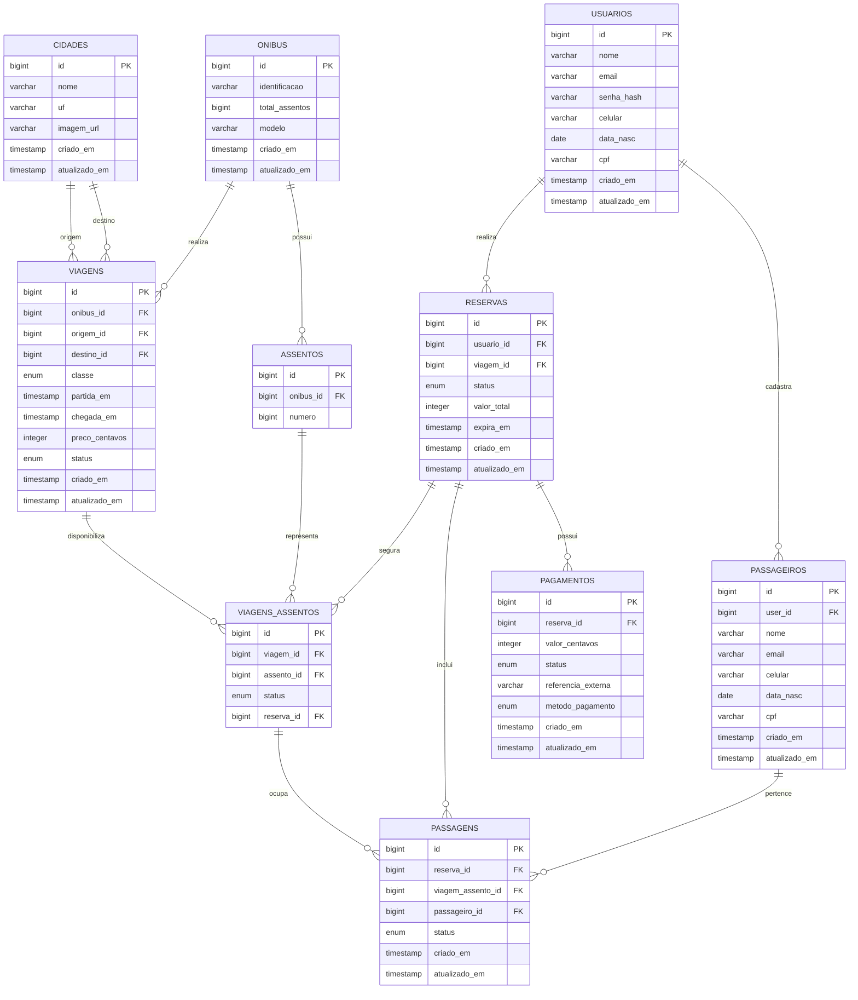

# Modelo de dados — Rotaê

**Status:** definição final do banco de dados do MVP.

Este documento descreve o schema utilizado pelo Rotaê, incluindo entidades, campos, relacionamentos, estados e principais regras de negócio. O modelo representa o fluxo de busca de viagens, seleção de assentos, criação de reservas, cadastro de passageiros e processamento de pagamentos.

## Como ler

* **Entidade:** representa um tipo de informação persistida no banco.
* **PK (chave primária):** identifica uma linha de forma única.
* **FK (chave estrangeira):** referencia a chave primária de outra entidade.
* **1:N:** uma linha pode estar relacionada a várias linhas da outra entidade.
* **1:1:** uma linha se relaciona com, no máximo, uma linha da outra entidade.
* **Nullable:** o campo pode não possuir valor (`NULL`).

---

## 1. Desenho dos relacionamentos



---

# 2. Entidades e campos

| Entidade               | Campos principais                                                                                                                                                                                                                         | Vínculos (FK)                                                                                                                             |
| ---------------------- | ----------------------------------------------------------------------------------------------------------------------------------------------------------------------------------------------------------------------------------------- | ----------------------------------------------------------------------------------------------------------------------------------------- |
| **`usuarios`**         | `id BIGINT` **PK**, `nome VARCHAR`, `email VARCHAR`, `senha_hash VARCHAR`, `celular VARCHAR`, `data_nasc DATE`, `cpf VARCHAR`, `criado_em TIMESTAMP`, `atualizado_em TIMESTAMP`                                                           | Nenhum. Um usuário pode realizar várias reservas e cadastrar vários passageiros.                                                          |
| **`passageiros`**      | `id BIGINT` **PK**, `user_id BIGINT` **nullable**, `nome VARCHAR`, `email VARCHAR`, `celular VARCHAR`, `data_nasc DATE`, `cpf VARCHAR`, `criado_em TIMESTAMP`, `atualizado_em TIMESTAMP`                                                  | `user_id → usuarios.id`. O vínculo com um usuário é opcional.                                                                             |
| **`cidades`**          | `id BIGINT` **PK**, `nome VARCHAR`, `uf VARCHAR`, `imagem_url VARCHAR`, `criado_em TIMESTAMP`, `atualizado_em TIMESTAMP`                                                                                                                  | Nenhum. É utilizada como origem ou destino de viagens. A combinação `(nome, uf)` deve ser única.                                                                                    |
| **`onibus`**           | `id BIGINT` **PK**, `identificacao VARCHAR`, `total_assentos BIGINT`, `modelo VARCHAR`, `criado_em TIMESTAMP`, `atualizado_em TIMESTAMP`                                                                                                  | Nenhum. Um ônibus possui vários assentos e pode realizar várias viagens.                                                                  |
| **`assentos`**         | `id BIGINT` **PK**, `onibus_id BIGINT`, `numero BIGINT`                                                                                                                                                                                   | `onibus_id → onibus.id`. Representa o assento físico pertencente a um ônibus. A combinação `(onibus_id, numero)` deve ser única.                                                             |
| **`viagens`**          | `id BIGINT` **PK**, `onibus_id BIGINT`, `origem_id BIGINT`, `destino_id BIGINT`, `classe ENUM`, `partida_em TIMESTAMP`, `chegada_em TIMESTAMP`, `preco_centavos INTEGER`, `status ENUM`, `criado_em TIMESTAMP`, `atualizado_em TIMESTAMP` | `onibus_id → onibus.id`; `origem_id → cidades.id`; `destino_id → cidades.id`.                                                             |
| **`viagens_assentos`** | `id BIGINT` **PK**, `viagem_id BIGINT`, `assento_id BIGINT`, `status ENUM`, `reserva_id BIGINT`                                                                                                                                           | `viagem_id → viagens.id`; `assento_id → assentos.id`; `reserva_id → reservas.id`. Controla o estado de cada assento dentro de uma viagem. |
| **`reservas`**         | `id BIGINT` **PK**, `usuario_id BIGINT`, `viagem_id BIGINT`, `status ENUM`, `valor_total INTEGER`, `expira_em TIMESTAMP`, `criado_em TIMESTAMP`, `atualizado_em TIMESTAMP`                                                                | `usuario_id → usuarios.id`; `viagem_id → viagens.id`. Uma reserva pode conter uma ou várias passagens.                                    |
| **`passagens`**        | `id BIGINT` **PK**, `reserva_id BIGINT`, `viagem_assento_id BIGINT`, `passageiro_id BIGINT`, `status ENUM`, `criado_em TIMESTAMP`, `atualizado_em TIMESTAMP`                                                                              | `reserva_id → reservas.id`; `viagem_assento_id → viagens_assentos.id`; `passageiro_id → passageiros.id`.                                  |
| **`pagamentos`**       | `id BIGINT` **PK**, `reserva_id BIGINT`, `valor_centavos INTEGER`, `status ENUM`, `referencia_externa VARCHAR`, `metodo_pagamento ENUM`, `criado_em TIMESTAMP`, `atualizado_em TIMESTAMP`                                                 | `reserva_id → reservas.id`. Registra o pagamento associado à reserva.                                                                     |

---

# 3. Estados das entidades

## 3.1 Viagens

O campo `viagens.status` possui os seguintes valores:

| Status       | Significado                                               |
| ------------ | --------------------------------------------------------- |
| `AGENDADA`   | Viagem criada e disponível conforme suas regras de venda. |
| `COMPLETADA` | Viagem já realizada.                                      |
| `CANCELADA`  | Viagem cancelada.                                         |

---

## 3.2 Assentos da viagem

O campo `viagens_assentos.status` possui os seguintes valores:

| Status       | Significado                                                                 |
| ------------ | --------------------------------------------------------------------------- |
| `DISPONIVEL` | O assento pode ser selecionado para uma nova reserva.                       |
| `SEGURADO`   | O assento está temporariamente associado a uma reserva ainda não concluída. |
| `RESERVADO`  | O assento foi confirmado após a conclusão da compra.                        |

O status é controlado **por viagem**, e não diretamente no registro de `assentos`.

Isso permite que o mesmo assento físico tenha estados diferentes em viagens diferentes.

Exemplo:

```text
Assento 12
    │
    ├── Viagem 101 → RESERVADO
    ├── Viagem 102 → DISPONIVEL
    └── Viagem 103 → SEGURADO
```

---

## 3.3 Reservas

O campo `reservas.status` possui os seguintes valores:

| Status               | Significado                                           |
| -------------------- | ----------------------------------------------------- |
| `PAGAMENTO_PENDENTE` | Reserva criada e aguardando pagamento.                |
| `PAGO`               | Pagamento aprovado e reserva confirmada.              |
| `EXPIRADO`           | Prazo da reserva terminou sem conclusão do pagamento. |
| `FALHA`              | Processo de pagamento não foi concluído com sucesso.  |
| `CANCELADO`          | Reserva cancelada.                                    |

Uma reserva pode conter **uma ou várias passagens**.

---

## 3.4 Passagens

O campo `passagens.status` possui os seguintes valores:

| Status       | Significado          |
| ------------ | -------------------- |
| `CONFIRMADO` | Passagem confirmada. |
| `CANCELADO`  | Passagem cancelada.  |

---

## 3.5 Pagamentos

O campo `pagamentos.status` possui os seguintes valores:

| Status     | Significado                                    |
| ---------- | ---------------------------------------------- |
| `PENDENTE` | Pagamento iniciado, mas ainda sem confirmação. |
| `APROVADO` | Pagamento aprovado pelo provedor.              |
| `NEGADO`   | Pagamento recusado pelo provedor.              |

O campo `pagamentos.metodo_pagamento` possui:

* `PIX`
* `CARTAO`

---

# 4. Regras de negócio e integridade

### 4.1 Usuários e passageiros

O usuário que realiza uma compra **não precisa ser um dos passageiros**.

Um usuário pode cadastrar passageiros para utilização em suas reservas:

```text
Usuário
   │
   ├── Passageiro A
   ├── Passageiro B
   └── Passageiro C
```

O campo `passageiros.user_id` é opcional. Portanto, um passageiro pode existir sem possuir uma conta de usuário.

Isso permite, por exemplo, que uma pessoa compre uma passagem para outra pessoa que não possui cadastro no sistema.

---

### 4.2 Origem e destino

Uma viagem possui diretamente uma cidade de origem e uma cidade de destino:

```text
viagens.origem_id   → cidades.id
viagens.destino_id  → cidades.id
```

A entidade `rotas` não faz parte do MVP.

A origem e o destino de uma mesma viagem devem representar **cidades diferentes**.

---

### 4.3 Empresa

A entidade `empresas` não faz parte do MVP.

O sistema trabalha inicialmente com **uma única empresa responsável pelas viagens**, portanto não existe necessidade de manter uma FK de empresa em `viagens`, `onibus` ou `rotas`.

---

### 4.4 Ônibus e assentos

Cada assento pertence a um único ônibus:

```text
onibus 1 ─── N assentos
```

O número do assento identifica sua posição dentro do ônibus.

O registro em `assentos` representa o **assento físico**, enquanto `viagens_assentos` representa esse mesmo assento no contexto de uma viagem específica.

---

### 4.5 Assentos por viagem

Ao disponibilizar um ônibus para uma viagem, seus assentos são representados em `viagens_assentos`.

A estrutura permite controlar independentemente o estado de cada assento em cada viagem:

```text
Ônibus
   │
   └── Assento 10
          │
          ├── Viagem A → DISPONIVEL
          └── Viagem B → RESERVADO
```

O assento utilizado por uma passagem deve pertencer ao ônibus escalado para a viagem correspondente.

Essa regra deve ser garantida pela aplicação e, quando aplicável, por restrições de integridade do banco.

---

### 4.6 Controle de concorrência dos assentos

Um mesmo assento **não pode ser utilizado simultaneamente por duas reservas ativas na mesma viagem**.

O controle é realizado por `viagens_assentos`, que possui um único estado para cada combinação de viagem e assento.

Durante a criação de uma reserva:

```text
Assento DISPONIVEL
        ↓
     Reserva
        ↓
Assento SEGURADO
        ↓
Pagamento aprovado
        ↓
Assento RESERVADO
```

Se a reserva expirar ou for cancelada antes da conclusão:

```text
Reserva EXPIRADA/CANCELADA
          ↓
Assento DISPONIVEL
```

A operação de alteração do assento deve ser realizada de forma transacional para evitar que duas requisições consigam reservar o mesmo assento simultaneamente.

---

### 4.7 Expiração de reservas

A reserva possui o campo `expira_em`, que determina até quando os assentos permanecem segurados para aquela reserva.

Enquanto a reserva estiver aguardando pagamento e dentro do prazo:

```text
reserva = PAGAMENTO_PENDENTE
assento = SEGURADO
```

Após a expiração:

```text
reserva = EXPIRADO
assento = DISPONIVEL
```

A liberação dos assentos deve ocorrer como parte do processamento da expiração da reserva.

---

### 4.8 Passagens

Cada passagem pertence a uma reserva e referencia:

* o passageiro que realizará a viagem;
* o assento específico daquela viagem.

Assim, `passagens` não referencia diretamente `assentos`. A referência ocorre por meio de `viagens_assentos`.

```text
PASSAGEM
   │
   ├── RESERVA
   ├── PASSAGEIRO
   └── VIAGEM_ASSENTO
              │
              ├── VIAGEM
              └── ASSENTO
```

Isso evita ambiguidades quando o mesmo assento físico aparece em várias viagens.

---

### 4.9 Valores monetários

Os valores monetários de `preco_centavos`, `valor_centavos` e `reservas.valor_total` são armazenados como inteiros em centavos.

Exemplo:

```text
8990 → R$ 89,90
15000 → R$ 150,00
```

---

### 4.10 Pagamentos

`pagamentos` registra o resultado do processamento do pagamento associado à reserva.

O sistema pode armazenar:

* valor da tentativa;
* status;
* referência externa fornecida pelo provedor;
* método de pagamento;
* datas de criação e atualização.

Não devem ser armazenados no banco dados sensíveis do cartão, como número completo ou código de segurança.

---

### 4.11 Dados de autenticação

`usuarios.senha_hash` deve armazenar somente o hash da senha produzido pelo mecanismo de autenticação utilizado pelo backend.

A senha original nunca deve ser persistida.

---

# 5. Resumo dos relacionamentos

| Origem             | Relação | Destino                |
| ------------------ | ------- | ---------------------- |
| `usuarios`         | 1:N     | `reservas`             |
| `usuarios`         | 1:N     | `passageiros`          |
| `onibus`           | 1:N     | `viagens`              |
| `onibus`           | 1:N     | `assentos`             |
| `cidades`          | 1:N     | `viagens` como origem  |
| `cidades`          | 1:N     | `viagens` como destino |
| `viagens`          | 1:N     | `viagens_assentos`     |
| `assentos`         | 1:N     | `viagens_assentos`     |
| `reservas`         | 1:N     | `viagens_assentos`     |
| `reservas`         | 1:N     | `passagens`            |
| `viagens_assentos` | 1:N     | `passagens`            |
| `passageiros`      | 1:N     | `passagens`            |
| `reservas`         | 1:N     | `pagamentos`           |

---

# 6. Decisões de modelagem do MVP

| Decisão               | Definição                                                                     |
| --------------------- | ----------------------------------------------------------------------------- |
| Empresas              | Uma única empresa; entidade `empresas` não faz parte do MVP.                  |
| Passageiros           | Separados de usuários. Um usuário pode comprar para outra pessoa.             |
| Passageiro com conta  | Opcional. `passageiros.user_id` aceita `NULL`.                                |
| Passagens por reserva | Uma reserva pode conter uma ou várias passagens.                              |
| Controle de assentos  | Realizado por `viagens_assentos`.                                             |
| Bloqueio temporário   | `SEGURADO` durante uma reserva pendente.                                      |
| Assento confirmado    | `RESERVADO` após pagamento aprovado.                                          |
| Expiração             | Controlada por `reservas.expira_em`.                                          |
| Concorrência          | A reserva/liberação do assento deve ser executada de forma transacional.      |
| Pagamento             | Associado à reserva e sem armazenamento de dados sensíveis do cartão.         |

---

## 7. Integridade recomendada

Além das FKs já definidas no schema, devem ser consideradas as seguintes restrições:

* `usuarios.email` deve ser único.
* `usuarios.cpf` deve ser único quando utilizado como identificador cadastral.
* `cidades` deve evitar duplicidade da mesma cidade/UF.
* `onibus.identificacao` deve identificar unicamente um ônibus.
* `assentos` não deve possuir dois registros com o mesmo número dentro do mesmo ônibus.
* `viagens_assentos` deve possuir apenas um registro para cada combinação de `viagem_id` + `assento_id`.
* Uma viagem não pode possuir a mesma cidade como origem e destino.
* O `assento` associado a `viagens_assentos` deve pertencer ao `onibus` utilizado pela `viagem`.
* Uma passagem deve utilizar um `viagem_assento` pertencente à mesma viagem da sua reserva.
* Um assento não pode permanecer associado a mais de uma reserva ativa simultaneamente.
* `preco_centavos`, `valor_centavos` e `valor_total` não devem aceitar valores negativos.
* `partida_em` deve ocorrer antes de `chegada_em`.
* A alteração de `viagens_assentos.status` durante reserva, pagamento, cancelamento ou expiração deve ser consistente com o estado da `reserva`.

Essas regras não precisam necessariamente ser todas implementadas como `CHECK`/`UNIQUE` simples no PostgreSQL; algumas envolvem múltiplas tabelas e devem ser garantidas por **transações e regras de domínio no backend**.

---

## 8. Escopo

O schema contém atualmente as 10 entidades do MVP:

```text
usuarios
passageiros
cidades
viagens
assentos
viagens_assentos
onibus
reservas
passagens
pagamentos
```