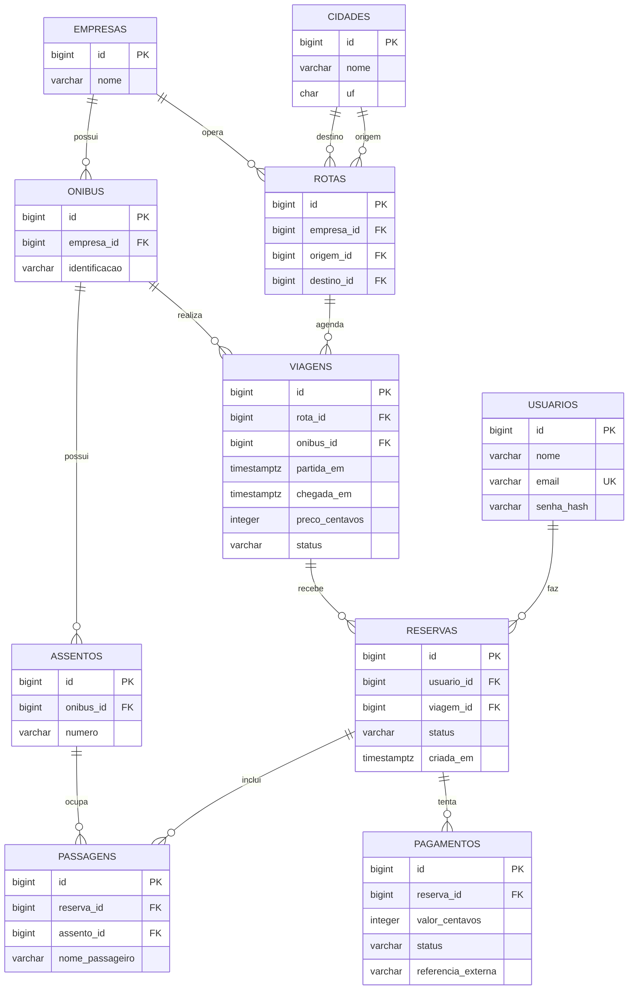

# Proposta de modelo de dados — Rotaê

**Status:** proposta para a equipe revisar antes de implementar o backend em Python.
Este documento descreve entidades e relacionamentos; não cria tabelas nem executa código.

## Como ler

- **Entidade:** tipo de informação guardada, como uma viagem.
- **PK (chave primária):** identifica uma linha de forma única.
- **FK (chave estrangeira):** aponta para a PK de outra entidade.
- **1:N:** uma linha pode se relacionar com várias linhas da outra entidade.

## Desenho dos relacionamentos

## Entidades e campos

| Entidade | Campos principais | Vínculos (FK) |
| --- | --- | --- |
| **usuarios** | `id BIGINT` **PK**, `nome VARCHAR(120)`, `email VARCHAR(254)` **UNIQUE**, `senha_hash VARCHAR(255)` | Nenhum. Um usuário pode criar várias reservas. |
| **cidades** | `id BIGINT` **PK**, `nome VARCHAR(120)`, `uf CHAR(2)` | Nenhum. A combinação `(nome, uf)` deve ser única. |
| **empresas** | `id BIGINT` **PK**, `nome VARCHAR(160)` | Nenhum. Opera rotas e possui ônibus. |
| **rotas** | `id BIGINT` **PK**, `empresa_id BIGINT`, `origem_id BIGINT`, `destino_id BIGINT` | `empresa_id → empresas.id`; `origem_id → cidades.id`; `destino_id → cidades.id`. |
| **onibus** | `id BIGINT` **PK**, `empresa_id BIGINT`, `identificacao VARCHAR(30)` | `empresa_id → empresas.id`. Identificação única por empresa. |
| **assentos** | `id BIGINT` **PK**, `onibus_id BIGINT`, `numero VARCHAR(5)` | `onibus_id → onibus.id`. A combinação `(onibus_id, numero)` deve ser única. |
| **viagens** | `id BIGINT` **PK**, `rota_id BIGINT`, `onibus_id BIGINT`, `partida_em TIMESTAMPTZ`, `chegada_em TIMESTAMPTZ`, `preco_centavos INTEGER`, `status VARCHAR(20)` | `rota_id → rotas.id`; `onibus_id → onibus.id`. |
| **reservas** | `id BIGINT` **PK**, `usuario_id BIGINT`, `viagem_id BIGINT`, `status VARCHAR(20)`, `criada_em TIMESTAMPTZ` | `usuario_id → usuarios.id`; `viagem_id → viagens.id`. |
| **passagens** | `id BIGINT` **PK**, `reserva_id BIGINT`, `assento_id BIGINT`, `nome_passageiro VARCHAR(120)` | `reserva_id → reservas.id`; `assento_id → assentos.id`. Uma reserva pode ter várias passagens. |
| **pagamentos** | `id BIGINT` **PK**, `reserva_id BIGINT`, `valor_centavos INTEGER`, `status VARCHAR(20)`, `referencia_externa VARCHAR(120)` | `reserva_id → reservas.id`. Permite registrar tentativas de pagamento sem armazenar dados do cartão. |

## Regras a validar com a equipe

1. A origem e o destino de uma rota devem ser cidades diferentes.
2. O ônibus de uma viagem deve pertencer à empresa responsável pela rota.
3. O assento de uma passagem deve existir no ônibus escalado para a viagem da reserva.
4. Um assento não pode estar em duas reservas **ativas** da mesma viagem; cancelamentos precisam liberar o lugar. A implementação precisa garantir isso no banco e na API Python para evitar vendas simultâneas.
5. `preco_centavos` e `valor_centavos` representam valores monetários inteiros; por exemplo, `8990` significa R$ 89,90.
6. `senha_hash` contém somente o resultado de um algoritmo apropriado de hash de senha executado pelo backend Python; a senha original não é armazenada.
7. `pagamentos` guarda identificadores e estados retornados pelo provedor, nunca número completo do cartão nem código de segurança.

**Limite do protótipo anterior:** os SQL `001` a `004` criavam apenas cidades, empresas, rotas e viagens com dados de exemplo. As outras entidades acima são uma **proposta** para a equipe discutir; este desenho não afirma que elas já existem no PostgreSQL.
